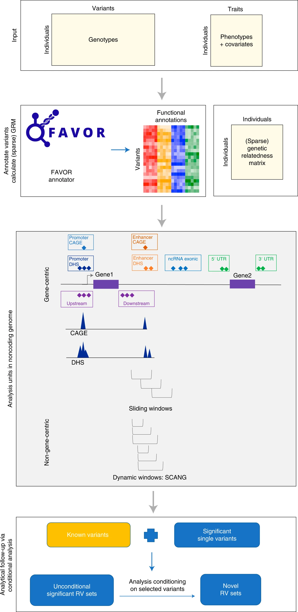
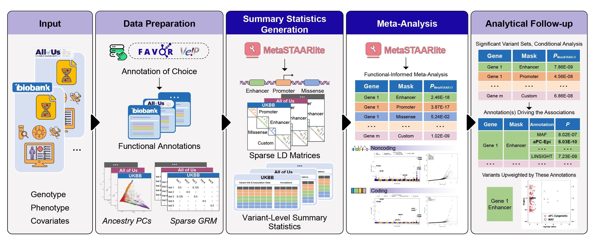

```{r setup, include=FALSE}
knitr::opts_chunk$set(echo = TRUE)
knitr::opts_knit$set(root.dir = "~/Downloads/IGES_2025_Education_Workshop/data/")
```

## Prerequisites 

The following packages are used throughout this tutorial

```{r packages, eval = FALSE}
install.packages("devtools")
install.packages("Matrix")
install.packages("BiocManager")
install.packages('restfulr')
install.packages('logistf')
install.packages('GMMAT')
install.packages("remotes")
install.packages("dplyr")

BiocManager::install('S4Vectors')
BiocManager::install('gdsfmt')
BiocManager::install('SeqArray')
BiocManager::install('SeqVarTools')
BiocManager::install('GENESIS')
BiocManager::install('GenomicFeatures')
BiocManager::install('TxDb.Hsapiens.UCSC.hg38.knownGene')

devtools::install_github('xihaoli/STAAR')
devtools::install_github('zilinli1988/SCANG')
devtools::install_github('xihaoli/MultiSTAAR',ref='main')
devtools::install_github('xihaoli/STAARpipeline',ref='main')
devtools::install_github('xihaoli/STAARpipelineSummary',ref='main')
devtools::install_github('xihaoli/MetaSTAAR',ref='main')
devtools::install_github("li-lab-genetics/MetaSTAARlite",ref="main")

remotes::install_github("privefl/bigsnpr")
```

```{r working directory,message=FALSE,warning=FALSE}
working_dir <- "~/Downloads/"
```

The data used for this tutorial is available at 

```{r data dowload, message=FALSE,warning=FALSE, eval = FALSE}
# Set working directory if running interactively
download.file(url = "https://dataverse.harvard.edu/api/access/datafile/11912614",
              destfile = paste0(working_dir,"IGES_2025.tar.gz"))

system(paste0("tar -xzvf ",working_dir,"IGES_2025.tar.gz -C",working_dir))
```

Update working directory

```{r working directory update,message=FALSE,warning=FALSE}
working_dir <- paste0(working_dir,"IGES_2025_Education_Workshop/data/")
```

## Common Variant PRS using bigsnpr

Polygenic risk scores are commonly built using publicly available GWAS summary statistics from large scale biobanks or consortiums. With these summary statistics and some estimate of the linkage disequilibrium matrix, we can produce polygenic risk scores with most existing methods. However, to apply these summary statistics or polygenic risk scores, we must align them with our target data. 

In the example below, we have a target dataset (`chr19.bed` and a simulated response `Phenotype_CommonVariant.csv`) and publicly available summary statistics or polygenic risk scores (`SumStats_Biobank.csv`). The simulated response was create using by assigning 5,000 common variants to be causal and their effects were simulated using `rnorm(0,1)`. Our goal is to use these estimated coefficients successfully on our target dataset. 

```{r common variant data,message = FALSE,warning = FALSE}
## Set up environment and load the data. 

library(bigsnpr)
library(dplyr)

setwd(working_dir)

## create a rds file and bk file with bigsnpr
## allows us to perform PRS calculations without plink.
if(file.exists("chr19.rds")){
  file.remove("chr19.rds")
  file.remove("chr19.bk") 
}
bigsnpr::snp_readBed("chr19.bed")

## Read the external summary statistics
SumStats_Biobank <- read.csv("SumStats_Biobank.csv")

## read the target data trait of interest
Phenotype_CommonVariant <- read.csv("Phenotype_CommonVariant.csv")

## Read the bim file
chr19_bim <- read.delim("chr19.bim", header=FALSE)

## attach the bigsnpr data object
obj.bigSNP <- bigsnpr::snp_attach("chr19.rds")
G <- obj.bigSNP$genotypes   # genotype matrix
```

Examine the structure of both the bim file and the summary statistics to see how they compare 

```{r str common variant files}
str(SumStats_Biobank)
str(chr19_bim)
```

The bim file has SNP IDs in the notation CHR:POS:A1:A2 while the summary statistics use rsIDs. If we took the summary statistics as they were and used them in plink, this would fail as the IDs would not match. Therefore we must align IDs of the summary statistics with the target data. Two ways to do this 1) modify the summary statistics or 2) modify the target data genotype file. We will use the first method, as we do not have access to plink in this demo.

```{r merge data, message=FALSE, warning = FALSE}
## Use the bim file to generate a NULL summary statistics file
## here we are assuming that the alternative allele and reference allele are the same as 
## what is provided in the bim file. In practice this is often not the case and better 
## to use plink to compute it.
sumstats <- data.frame(SNP = chr19_bim[,2],pos = chr19_bim[,4], 
                       ref = chr19_bim[,5], alt = chr19_bim[,6], beta = 0)

## first add chr and pos
setwd(working_dir)
SNPinfo <- read.csv("SNPInfo_GrCH38.csv")
SNPinfo <- data.frame(rsid = SNPinfo$rsid,chr = SNPinfo$chr, pos = SNPinfo$pos38)

SumStats_Biobank <- left_join(SumStats_Biobank,SNPinfo, by = c("RSID" = "rsid"))

## Next create a unique id to merge the null file and the biobank sumstats
sumstats$unique_id <- paste0(19,"_",sumstats$pos,"_",sumstats$ref,"_",sumstats$alt)
SumStats_Biobank$unique_id1 <- paste0(19,"_",SumStats_Biobank$pos,"_",SumStats_Biobank$REF,
                                      "_",SumStats_Biobank$ALT)
SumStats_Biobank$unique_id2 <- paste0(19,"_",SumStats_Biobank$pos,"_",SumStats_Biobank$ALT,
                                      "_",SumStats_Biobank$REF)

## Merge by the unique CHR_POS_A0_A1 ID to add the estimated coefficients to our NULL file
sumstats <- left_join(sumstats,SumStats_Biobank[,c("unique_id1","BETA")],
                      by = c("unique_id" = "unique_id1"))
sumstats$beta[!is.na(sumstats$BETA)] <- sumstats$BETA[!is.na(sumstats$BETA)]
sumstats <- subset(sumstats,select = -c(BETA))
sumstats <- left_join(sumstats,SumStats_Biobank[,c("unique_id2","BETA")],
                      by = c("unique_id" = "unique_id2"))
sumstats$beta[!is.na(sumstats$BETA)] <- sumstats$BETA[!is.na(sumstats$BETA)]
sumstats <- subset(sumstats,select = -c(BETA))

str(sumstats)
```

The new summary statistics now have the same IDs as the bim file. Therefore we can now calculate a PRS.

```{r incorrect PRS, warning=FALSE,message = FALSE}
## Calculate the PRS
Test <- big_prodVec(G, sumstats$beta)
all.equal(Test,Phenotype_CommonVariant$Y)
cor(Test,Phenotype_CommonVariant$Y)
```

However, this PRS is not correct. When we merged the IDs from the we did not properly account for the reference/alternative allele differences between our target data and the summary statistics. When an estimated coefficient for a given SNP has been computed with flipped alleles compared to the target dataset, the estimated coefficient should be flipped (i.e. (-1 x)).

```{r correct PRS,warning=FALSE,message=FALSE}
## However, the PRS above did not account for the mismatched alleles, 
## if the reference allele is different (target data vs training data) we also have to flip beta's
sumstats$beta[sumstats$unique_id %in% SumStats_Biobank$unique_id2] <- 
  (-1)*sumstats$beta[sumstats$unique_id %in% SumStats_Biobank$unique_id2]

## This improves are accuracy with our response
Test <- big_prodVec(G, sumstats$beta)
all.equal(Test,Phenotype_CommonVariant$Y)
cor(Test,Phenotype_CommonVariant$Y)
```

After flipping the alleles we now have a more accurate PRS.

## Common Variant Meta-analysis using METAL

Another common tasks that is conducted with cross-biobank analyses are meta-analyses. Here we illustrate how to set up a GWAS meta-analysis using METAL. First we set up the data.

```{r METAL Analysis Prep,warning=FALSE,message=FALSE}
setwd(working_dir)

SumStats_Biobank1 <- read.csv("SumStats_Biobank.csv")

SNPinfo <- read.csv("SNPInfo_GrCH38.csv")
SNPinfo <- data.frame(rsid = SNPinfo$rsid, chr = SNPinfo$chr, pos = SNPinfo$pos38)
SumStats_Biobank1 <- left_join(SumStats_Biobank1,SNPinfo, by = c("RSID" = "rsid"))

SumStats_Biobank1 <- data.frame(SNP = SumStats_Biobank1$RSID,
                                CHR = SumStats_Biobank1$chr, 
                                BP = SumStats_Biobank1$pos,
                                EA = SumStats_Biobank1$ALT,
                                NEA = SumStats_Biobank1$REF,
                                BETA = SumStats_Biobank1$BETA,
                                SE = SumStats_Biobank1$SE,
                                P = SumStats_Biobank1$PVAL,
                                N = SumStats_Biobank1$N)

SumStats_Biobank2 <- SumStats_Biobank1[sample(1:nrow(SumStats_Biobank1),
                                              round(0.8*nrow(SumStats_Biobank1))),]

write.table(SumStats_Biobank1,file = "SumStats_Biobank1.txt",sep = "\t",
            quote = FALSE,row.names = FALSE)
write.table(SumStats_Biobank2,file = "SumStats_Biobank2.txt",sep = "\t",
            quote = FALSE,row.names = FALSE)
```

The summary statistics must contain the same ID naming across the two files, if not METAL will fail. But unlike the PRS calculation, alleles do not have to be matched before as METAL will do that automatically. However, it is good practice to be aware what the software is doing to align alleles and handle strand flipping. Below then is example code to run METAL.

```{r,METAL Analysis,warning=FALSE,message=FALSE}
setwd(working_dir)

metal_script <- c(
  "SCHEME STDERR",
  "MARKER SNP",
  "ALLELE EA NEA",
  "EFFECT BETA",
  "STDERR SE",
  "PVAL P",
  "WEIGHT N",
  "",
  "PROCESS SumStats_Biobank1.txt",
  "PROCESS SumStats_Biobank2.txt",
  "",
  "OUTFILE meta_results_ .tbl",
  "ANALYZE"
)

writeLines(metal_script, "metal_script.txt")

# system("./metal metal_script.txt")
```

## Rare Variant Association Analysis using STAARpipeline



### aGDS File Generation
The next example we discuss is rare variant association testing using STAARpipeline (https://doi.org/10.1038/s41592-022-01640-x). To do this, we utilize the annotated Genomic Data Structure (aGDS) format. The SeqArray GDS format is designed as a storage-efficient high-performance data format for WGS variant calls, utilizing a hierarchical structure to support efficient data access and seamless integration with several analytical pipelines. The aGDS format further extends the capabilities of SeqArray GDS by incorporating multi-faceted variant annotations to facilitate functionally-informed downstream analysis within an all-in-one file (see https://doi.org/10.1101/2025.01.27.25321225 for more details about aGDS format).

First, we illustrate how to create a SeqArray GDS file using chromosome 19 of the 1000G WGS VCF file (downloadable at https://ftp.1000genomes.ebi.ac.uk/vol1/ftp/data_collections/1000G_2504_high_coverage/working/20220422_3202_phased_SNV_INDEL_SV/) to be used in STAARpipeline.   

```{r,Rare Variant GDS Prep,warning=FALSE,message=FALSE,eval=FALSE}
### Setup repository
setwd(working_dir)
getOption('timeout')
options(timeout=200)

### Download 1000 Genomes Project (1kGP) high-coverage Illumina integrated phased panel
# ETA: 1 minute
download.file(url = "https://ftp.1000genomes.ebi.ac.uk/vol1/ftp/data_collections/1000G_2504_high_coverage/working/20220422_3202_phased_SNV_INDEL_SV/1kGP_high_coverage_Illumina.chr19.filtered.SNV_INDEL_SV_phased_panel.vcf.gz",
              destfile = "1kGP_high_coverage_Illumina.chr19.filtered.SNV_INDEL_SV_phased_panel.vcf.gz")

### Convert 1000G WGS Data VCF files to Genomic Data Structure (GDS) files
library(gdsfmt)
library(SeqArray)

# input_dir
vcf.fn <- "1kGP_high_coverage_Illumina.chr19.filtered.SNV_INDEL_SV_phased_panel.vcf.gz"

# output_dir
out.fn <- "1kGP_high_coverage_Illumina.chr19.filtered.SNV_INDEL_SV_phased_panel.gds"

# modify the header 
h <- seqVCF_Header(vcf.fn)
# h$info
h$info$Number[h$info$ID=="SOURCE"] <- "."

# ETA: 10 minutes (one-time conversion)
seqVCF2GDS(vcf.fn, out.fn, header = h, genotype.var.name = "GT", info.import=NULL, fmt.import=NULL, 
           ignore.chr.prefix="chr", raise.error=TRUE, verbose=TRUE)
```

Next, we functionally annotate the 1000G WGS GDS file to an aGDS file for
chromosome 19 using the FAVOR database (https://favor.genohub.org/) and FAVORannotator. Note that the following scripts are used for the favorannotator app in the DNAnexus platform (https://github.com/li-lab-genetics/favorannotator-rap). There are also offline scripts for favorannotator ready for use, available at
https://github.com/xihaoli/STAARpipeline-Tutorial#generate-annotated-gds-agds-file-using-favorannotator.

```{r,Rare Variant aGDS Prep,warning=FALSE,message=FALSE,eval=FALSE}
# Upload 1000G WGS GDS files to DNAnexus RAP Cloud (Drag the files)

#-------------------------------------------------------------------
# The following are dx-toolkit command line scripts, not R scripts
# Install DNAnexus Platform SDK (MacOS)
tar -xzf dx-toolkit-0.398.0.tar.gz
source dx-toolkit-0.398.0/environment

##### Usage
cd dx-toolkit-0.398.0/bin
#dx upgrade

##### Log in
dx login
#dx ls (here we assume to have a project named ukbb_lilab)

# Clone this github repo to some directory:
git clone https://github.com/li-lab-genetics/favorannotator-rap.git

# Navigate to a relevant directory within the project directory on the DNAnexus platform
dx cd UKB_PRS:/
  
# Compile the source code:
dx build -f favorannotator-rap

# Create a new folder (UKB_PRS/IGES_2025_Education_Workshop/1000G/aGDS)
# on DNAnexus under the project directory
# Run favorannotator on DNAnexus (ETA: 26 minutes)
dx run UKB_PRS:/favorannotator \
-igds_file=UKB_PRS:/IGES_2025_Education_Workshop/1000G/GDS/1kGP_high_coverage_Illumina.chr19.filtered.SNV_INDEL_SV_phased_panel.gds \
-ichromosome=19 \
-iuse_compression=YES \
-ioutfile=1kGP_high_coverage_Illumina.chr19.filtered.SNV_INDEL_SV_phased_panel_annotated \
--destination=UKB_PRS:/IGES_2025_Education_Workshop/1000G/aGDS --yes
#-------------------------------------------------------------------

### Adds QC_label with all "PASS" to a post-QC aGDS file (R scripts)
gds.path <- "1kGP_high_coverage_Illumina.chr19.filtered.SNV_INDEL_SV_phased_panel_annotated.gds"
genofile <- seqOpen(gds.path, readonly = FALSE)
#genofile
position <- as.integer(seqGetData(genofile, "position"))
length(position)
Anno.folder <- index.gdsn(genofile, "annotation/info")
add.gdsn(Anno.folder, "QC_label", val=factor(rep("PASS", length(position))), compress="LZMA_ra", closezip=TRUE)
#genofile
seqClose(genofile)
```

### STAARpipeline Set-Up
Once the aGDS file is created we are now able to conduct functionally-informed rare variant association testing with STAARpipeline. Here we simulate a phenotype (column `Y` in the `data/phenotype_LDLR_coding_APOE_noncoding.csv` file) where both the putative loss of function and disruptive missense (`plof_ds`) rare variants in *LDLR* and the enhancer overlaid with DNase I hypersensitivity sites (`enhancer_DHS`) rare variants in *APOE* are causally associated with our simulated phenotype (see the scripts `scripts/Tutorial_scripts_part2.2_Example_Simulated_Phenotype.R` for simulating the phenotype).

```{r,Rare Variant Association Testing,warning=FALSE,message=FALSE}
### Setup repository
setwd(working_dir)

### load required package
library(gdsfmt)
library(SeqArray)
library(SeqVarTools)
library(STAAR)
library(STAARpipeline)
library(STAARpipelineSummary)

## agds file
agds_dir <- "1kGP_high_coverage_Illumina.chr19.filtered.SNV_INDEL_SV_phased_panel_annotated.gds"
## Annotation_dir
Annotation_dir <- "annotation/info/FunctionalAnnotation"
## Annotation channel
Annotation_name_catalog <- read.csv(url("https://raw.githubusercontent.com/xihaoli/STAARpipeline-Tutorial/refs/heads/main/FAVORannotator_csv/Annotation_name_catalog.csv"))

## channel name of the QC label in the GDS/aGDS file
QC_label <- "annotation/info/QC_label"
## variant type
variant_type <- "SNV"
## geno_missing_imputation
geno_missing_imputation <- "mean"
## genes info
genes <- genes_info
## extract phenotype sample.id
pheno_cov <- read.table("integrated_call_samples_v3.20130502.ALL.panel",header=TRUE)
phenotype.id <- as.vector(pheno_cov$sample)
length(phenotype.id)

## Use_annotation_weights
Use_annotation_weights <- TRUE
## Annotation name (for variant weighting using the STAAR method)
Annotation_name <- c("CADD",
                     "LINSIGHT",
                     "FATHMM.XF",
                     "aPC.EpigeneticActive",
                     "aPC.EpigeneticRepressed",
                     "aPC.EpigeneticTranscription",
                     "aPC.Conservation",
                     "aPC.LocalDiversity",
                     "aPC.Mappability",
                     "aPC.TF",
                     "aPC.Protein")
## Annotation name (for variants info in summary)
Annotation_name_info <- c("rs_num",
                          "GENCODE.Category",
                          "GENCODE.Info",
                          "GENCODE.EXONIC.Category",
                          "MetaSVM",
                          "GeneHancer",
                          "CAGE",
                          "DHS",
                          "CADD",
                          "LINSIGHT",
                          "FATHMM.XF",
                          "aPC.EpigeneticActive",
                          "aPC.EpigeneticRepressed",
                          "aPC.EpigeneticTranscription",
                          "aPC.Conservation",
                          "aPC.LocalDiversity",
                          "aPC.Mappability",
                          "aPC.TF",
                          "aPC.Protein")

## known loci: rs7412 (APOE), rs429358 (APOE), rs35136575 (APOE), rs12151108 (LDLR), rs688 (LDLR), rs6511720 (LDLR)
known_loci <- read.csv("known_loci_info.csv")
known_loci

##########################################
#       load phenotype and ancestry PCs
##########################################
### phenotype
pheno <- read.csv("phenotype_LDLR_coding_APOE_noncoding.csv")
### PCs
PCs <- read.csv("1000G_PCA.csv")

pheno <- dplyr::left_join(pheno,PCs[,2:12],by=c("sample"="id"))

##########################################
#       fit null model
##########################################
obj_nullmodel <- fit_nullmodel(Y~gender+super_pop+PC1+PC2+PC3+PC4+PC5+PC6+PC7+PC8+PC9+PC10,
                               data = pheno, kins = NULL, id = "sample",
                               family = gaussian(link = "identity"), verbose=T)
```

### Gene-Centric Coding Analysis of *LDLR*
Here we perform gene-centric coding analysis of different functional categories (masks) of the *LDLR* gene. Note that STAARpipeline provides multiple masks for functionally-informed rare variant analysis, including putative loss of function (`plof`), putative loss of function and disruptive missense (`plof_ds`), missense (`missense`), disruptive missense (`disruptive_missense`), synonymous (`synonymous`), protein truncating variants (`ptv`), and protein truncating variants and disruptive missense (`ptv_ds`). In addition, STAARpipeline calculates the *P* value of each mask using STAAR-O, an omnibus test aggregating the multiple annotation-weighted burden test, SKAT and ACAT-V in the STAAR framework.

```{r,Gene-centric coding analysis of LDLR,warning=FALSE,message=FALSE}
##########################################
#       Gene-Centric Coding: LDLR
##########################################

### run coding mask of LDLR
gene_name <- "LDLR"

## genotype: chr 
chr <- 19
gds.path <- agds_dir
genofile <- seqOpen(gds.path)

results_coding <- Gene_Centric_Coding(chr=chr,
                                      gene_name=gene_name,
                                      genofile=genofile,
                                      obj_nullmodel=obj_nullmodel,
                                      rare_maf_cutoff=0.01,
                                      rv_num_cutoff=2,
                                      QC_label=QC_label,
                                      variant_type=variant_type,
                                      geno_missing_imputation=geno_missing_imputation,
                                      Annotation_dir=Annotation_dir,
                                      Annotation_name_catalog=Annotation_name_catalog,
                                      Use_annotation_weights=Use_annotation_weights,
                                      Annotation_name=Annotation_name)

results_coding
```

As expected, the STAAR-O *P* value (9.44e-09) for the `plof_ds` mask is the most significant among all masks tested, consistent with the phenotype simulation. We then perform an analytical follow-up using conditional analysis to identify whether the rare variant association signal (`plof_ds` rare variants of *LDLR*) is independent of known single-variant associations by adjusting for the selected known variants near the variant set (for example, in a ±1-Mb window).

```{r,LDLR conditional analysis,warning=FALSE,message=FALSE}
## Conditional Analysis
category <- "plof_ds"								
results_coding_cond <- Gene_Centric_Coding_cond(chr=chr,
                                                gene_name=gene_name,
                                                genofile=genofile,
                                                obj_nullmodel=obj_nullmodel,
                                                category=category,
                                                known_loci=known_loci,
                                                rare_maf_cutoff=0.01,
                                                rv_num_cutoff=2,
                                                QC_label=QC_label,
                                                variant_type=variant_type,
                                                geno_missing_imputation=geno_missing_imputation,
                                                Annotation_dir=Annotation_dir,
                                                Annotation_name_catalog=Annotation_name_catalog,
                                                Use_annotation_weights=Use_annotation_weights,
                                                Annotation_name=Annotation_name)
								
results_coding_cond
```

The conditional STAAR-O *P* value remains significant, indicating that this rare variant association signal may be independent of known single-variant associations. We then take a closer look at this mask by summarizing individual variants within the mask.

```{r,LDLR variant info,warning=FALSE,message=FALSE}
## variants info for summary
results_coding_info <- Gene_Centric_Coding_Info(category=category,
                                                chr=chr,
                                                genofile=genofile,
                                                obj_nullmodel=obj_nullmodel,
                                                gene_name=gene_name,
                                                known_loci=known_loci,
                                                QC_label=QC_label,
                                                variant_type=variant_type,
                                                geno_missing_imputation=geno_missing_imputation,
                                                Annotation_dir=Annotation_dir,
                                                Annotation_name_catalog=Annotation_name_catalog,
                                                Annotation_name=Annotation_name_info)
		
dim(results_coding_info)
head(results_coding_info)

seqClose(genofile)
```

### Gene-Centric Noncoding Analysis of *APOE*
Here we perform gene-centric noncoding analysis of different functional categories (masks) of the *APOE* gene. Note that STAARpipeline provides multiple masks for functionally-informed rare variant analysis, including upstream region (`upstream`), downstream region (`downstream`), untranslated region (`UTR`), promoter rare variants overlaid with cap analysis of gene expression (CAGE) sites (`promoter_CAGE`), promoter rare variants overlaid with DNase hypersensitivity (DHS) sites (`promoter_DHS`), enhancer rare variants overlaid with cap analysis of gene expression sites (`enhancer_CAGE`), and enhancer rare variants overlaid with DNase hypersensitivity sites (`enhancer_DHS`). In addition, STAARpipeline performs analysis of rare variants in noncoding RNA (ncRNA) genes. For each mask, STAARpipeline calculates the *P* value using STAAR-O, an omnibus test aggregating the multiple annotation-weighted burden test, SKAT and ACAT-V in the STAAR framework.

```{r,Gene-centric noncoding analysis of APOE,warning=FALSE,message=FALSE}			
##########################################
#       Gene-Centric Noncoding: APOE
##########################################

### run noncoding mask of APOE
gene_name <- "APOE"

## genotype: chr 
chr <- 19
gds.path <- agds_dir
genofile <- seqOpen(gds.path)

results_noncoding <- Gene_Centric_Noncoding(chr=chr,
                                            gene_name=gene_name,
                                            genofile=genofile,
                                            obj_nullmodel=obj_nullmodel,
                                            rare_maf_cutoff=0.01,
                                            rv_num_cutoff=2,
                                            QC_label=QC_label,
                                            variant_type=variant_type,
                                            geno_missing_imputation=geno_missing_imputation,
                                            Annotation_dir=Annotation_dir,
                                            Annotation_name_catalog=Annotation_name_catalog,
                                            Use_annotation_weights=Use_annotation_weights,
                                            Annotation_name=Annotation_name)

results_noncoding
```

As expected, the STAAR-O *P* value (1.71e-08) for the `enhancer_DHS` mask is the most significant among all masks tested, consistent with the phenotype simulation. We then perform an analytical follow-up using conditional analysis to identify whether the rare variant association signal (`enhancer_DHS` rare variants of *APOE*) is independent of known single-variant associations by adjusting for the selected known variants near the variant set (for example, in a ±1-Mb window).

```{r,APOE conditional analysis,warning=FALSE,message=FALSE}
## Conditional Analysis
category <- "enhancer_DHS"								
results_noncoding_cond <- Gene_Centric_Noncoding_cond(chr=chr,
                                                      gene_name=gene_name,
                                                      genofile=genofile,
                                                      obj_nullmodel=obj_nullmodel,
                                                      category=category,
                                                      known_loci=known_loci,
                                                      rare_maf_cutoff=0.01,
                                                      rv_num_cutoff=2,
                                                      QC_label=QC_label,
                                                      variant_type=variant_type,
                                                      geno_missing_imputation=geno_missing_imputation,
                                                      Annotation_dir=Annotation_dir,
                                                      Annotation_name_catalog=Annotation_name_catalog,
                                                      Use_annotation_weights=Use_annotation_weights,
                                                      Annotation_name=Annotation_name)

results_noncoding_cond
```

The conditional STAAR-O *P* value remains significant, indicating that this rare variant association signal may be independent of known single-variant associations. We then take a closer look at this mask by summarizing individual variants within the mask.

```{r,APOE variant info,warning=FALSE,message=FALSE}
## variants info for summary
results_noncoding_info <- Gene_Centric_Noncoding_Info(category=category,
                                                      chr=chr,
                                                      genofile=genofile,
                                                      obj_nullmodel=obj_nullmodel,
                                                      gene_name=gene_name,
                                                      known_loci=known_loci,
                                                      QC_label=QC_label,
                                                      variant_type=variant_type,
                                                      geno_missing_imputation=geno_missing_imputation,
                                                      Annotation_dir=Annotation_dir,
                                                      Annotation_name_catalog=Annotation_name_catalog,
                                                      Annotation_name=Annotation_name_info)

dim(results_noncoding_info)
head(results_noncoding_info)
								
seqClose(genofile)
```

## Rare Variant Meta-Analysis using MetaSTAARlite



### MetaSTAARlite Set-Up
Finally, we demonstrate an example of conducting rare variant meta-analysis from multiple biobanks/studies using the estimated rare variant summary statistics from MetaSTAARlite (https://doi.org/10.1101/2025.06.05.25328973). For illustrative purposes, we will use summary statistics from different population subsets (AFR, AMR, EAS, EUR, SAS) of the 1000G cohort. In a more realistic setting, the data from these subsets/studies are stored separately.

```{r,Rare Variant Meta-Analysis with MetaSTAARlite,warning=FALSE,message=FALSE,eval=FALSE}
### Setup repository
setwd(working_dir)

### load required package
library(gdsfmt)
library(SeqArray)
library(SeqVarTools)
library(STAAR)
library(STAARpipeline)
library(MetaSTAAR)
library(MetaSTAARlite)
library(Matrix)

## agds file
agds_dir <- "1kGP_high_coverage_Illumina.chr19.filtered.SNV_INDEL_SV_phased_panel_annotated.gds"
## Annotation_dir
Annotation_dir <- "annotation/info/FunctionalAnnotation"
## Annotation channel
Annotation_name_catalog <- read.csv(url("https://raw.githubusercontent.com/xihaoli/STAARpipeline-Tutorial/refs/heads/main/FAVORannotator_csv/Annotation_name_catalog.csv"))

## channel name of the QC label in the GDS/aGDS file
QC_label <- "annotation/info/QC_label"
## variant type
variant_type <- "SNV"
## geno_missing_imputation
geno_missing_imputation <- "mean"
## genes info
genes <- genes_info
## extract phenotype sample.id
pheno_cov <- read.table("integrated_call_samples_v3.20130502.ALL.panel",header=TRUE)
phenotype.id <- as.vector(pheno_cov$sample)
length(phenotype.id)
# [1] 2504

## Use_annotation_weights
Use_annotation_weights <- TRUE
## Annotation name (for variant weighting using the MetaSTAAR method)
Annotation_name <- c("CADD",
                     "LINSIGHT",
                     "FATHMM.XF",
                     "aPC.EpigeneticActive",
                     "aPC.EpigeneticRepressed",
                     "aPC.EpigeneticTranscription",
                     "aPC.Conservation",
                     "aPC.LocalDiversity",
                     "aPC.Mappability",
                     "aPC.TF",
                     "aPC.Protein")

##########################################
#       load phenotype and ancestry PCs
##########################################
### phenotype
pheno <- read.csv("phenotype_LDLR_coding_APOE_noncoding.csv")
### PCs
PCs <- read.csv("1000G_PCA.csv")

pheno <- dplyr::left_join(pheno,PCs[,2:12],by=c("sample"="id"))

##########################################
#       fit null model for each "study"
##########################################
obj_nullmodel_AFR <- fit_nullmodel(Y~gender+PC1+PC2+PC3+PC4+PC5+PC6+PC7+PC8+PC9+PC10,
                                   data = pheno[pheno$super_pop=="AFR",],
                                   kins = NULL, id = "sample",
                                   family = gaussian(link = "identity"), verbose=T)
obj_nullmodel_AMR <- fit_nullmodel(Y~gender+PC1+PC2+PC3+PC4+PC5+PC6+PC7+PC8+PC9+PC10,
                                   data = pheno[pheno$super_pop=="AMR",],
                                   kins = NULL, id = "sample",
                                   family = gaussian(link = "identity"), verbose=T)
obj_nullmodel_EAS <- fit_nullmodel(Y~gender+PC1+PC2+PC3+PC4+PC5+PC6+PC7+PC8+PC9+PC10,
                                   data = pheno[pheno$super_pop=="EAS",],
                                   kins = NULL, id = "sample",
                                   family = gaussian(link = "identity"), verbose=T)
obj_nullmodel_EUR <- fit_nullmodel(Y~gender+PC1+PC2+PC3+PC4+PC5+PC6+PC7+PC8+PC9+PC10,
                                   data = pheno[pheno$super_pop=="EUR",],
                                   kins = NULL, id = "sample",
                                   family = gaussian(link = "identity"), verbose=T)
obj_nullmodel_SAS <- fit_nullmodel(Y~gender+PC1+PC2+PC3+PC4+PC5+PC6+PC7+PC8+PC9+PC10,
                                   data = pheno[pheno$super_pop=="SAS",],
                                   kins = NULL, id = "sample",
                                   family = gaussian(link = "identity"), verbose=T)
```

### Generate Rare Variant Summary Statistics for Each Participating Study
First, we generate and store the rare variant summary statistics for each participating study, including the score statistics and sparse covariance (also called LD) matrices, using the `worker` step from MetaSTAARlite.

```{r,Generate Rare Variant Summary Statistics with MetaSTAARlite worker,warning=FALSE,message=FALSE,eval=FALSE}
##########################################
#       Gene-Centric Coding: LDLR
##########################################

### run coding mask of LDLR
gene_name <- "LDLR"

## genotype: chr 
chr <- 19
gds.path <- agds_dir
genofile <- seqOpen(gds.path)

genes <- genes_info

## AFR
coding_sumstat <- list()
coding_cov <- list()
results_coding_AFR <- coding_MetaSTAARlite_worker(chr=chr,
                                                  gene_name=gene_name,
                                                  genofile=genofile,
                                                  obj_nullmodel=obj_nullmodel_AFR,
                                                  gene=genes,
                                                  cov_maf_cutoff=0.05,
                                                  QC_label=QC_label,
                                                  variant_type=variant_type,
                                                  Annotation_dir=Annotation_dir,
                                                  Annotation_name_catalog=Annotation_name_catalog,
                                                  Use_annotation_weights=Use_annotation_weights,
                                                  Annotation_name=Annotation_name)

coding_sumstat[[gene_name]] <- results_coding_AFR$summary_stat_list
coding_cov[[gene_name]] <- results_coding_AFR$GTSinvG_rare_list

save(coding_sumstat,file="AFR_LDLR_coding_sumstat.Rdata",compress = "xz")
save(coding_cov,file="AFR_LDLR_coding_cov.Rdata",compress = "xz")

## AMR
coding_sumstat <- list()
coding_cov <- list()
results_coding_AMR <- coding_MetaSTAARlite_worker(chr=chr,
                                                  gene_name=gene_name,
                                                  genofile=genofile,
                                                  obj_nullmodel=obj_nullmodel_AMR,
                                                  gene=genes,
                                                  cov_maf_cutoff=0.05,
                                                  QC_label=QC_label,
                                                  variant_type=variant_type,
                                                  Annotation_dir=Annotation_dir,
                                                  Annotation_name_catalog=Annotation_name_catalog,
                                                  Use_annotation_weights=Use_annotation_weights,
                                                  Annotation_name=Annotation_name)

coding_sumstat[[gene_name]] <- results_coding_AMR$summary_stat_list
coding_cov[[gene_name]] <- results_coding_AMR$GTSinvG_rare_list

save(coding_sumstat,file="AMR_LDLR_coding_sumstat.Rdata",compress = "xz")
save(coding_cov,file="AMR_LDLR_coding_cov.Rdata",compress = "xz")

## EAS
coding_sumstat <- list()
coding_cov <- list()
results_coding_EAS <- coding_MetaSTAARlite_worker(chr=chr,
                                                  gene_name=gene_name,
                                                  genofile=genofile,
                                                  obj_nullmodel=obj_nullmodel_EAS,
                                                  gene=genes,
                                                  cov_maf_cutoff=0.05,
                                                  QC_label=QC_label,
                                                  variant_type=variant_type,
                                                  Annotation_dir=Annotation_dir,
                                                  Annotation_name_catalog=Annotation_name_catalog,
                                                  Use_annotation_weights=Use_annotation_weights,
                                                  Annotation_name=Annotation_name)

coding_sumstat[[gene_name]] <- results_coding_EAS$summary_stat_list
coding_cov[[gene_name]] <- results_coding_EAS$GTSinvG_rare_list

save(coding_sumstat,file="EAS_LDLR_coding_sumstat.Rdata",compress = "xz")
save(coding_cov,file="EAS_LDLR_coding_cov.Rdata",compress = "xz")

## EUR
coding_sumstat <- list()
coding_cov <- list()
results_coding_EUR <- coding_MetaSTAARlite_worker(chr=chr,
                                                  gene_name=gene_name,
                                                  genofile=genofile,
                                                  obj_nullmodel=obj_nullmodel_EUR,
                                                  gene=genes,
                                                  cov_maf_cutoff=0.05,
                                                  QC_label=QC_label,
                                                  variant_type=variant_type,
                                                  Annotation_dir=Annotation_dir,
                                                  Annotation_name_catalog=Annotation_name_catalog,
                                                  Use_annotation_weights=Use_annotation_weights,
                                                  Annotation_name=Annotation_name)

coding_sumstat[[gene_name]] <- results_coding_EUR$summary_stat_list
coding_cov[[gene_name]] <- results_coding_EUR$GTSinvG_rare_list

save(coding_sumstat,file="EUR_LDLR_coding_sumstat.Rdata",compress = "xz")
save(coding_cov,file="EUR_LDLR_coding_cov.Rdata",compress = "xz")

## SAS
coding_sumstat <- list()
coding_cov <- list()
results_coding_SAS <- coding_MetaSTAARlite_worker(chr=chr,
                                                  gene_name=gene_name,
                                                  genofile=genofile,
                                                  obj_nullmodel=obj_nullmodel_SAS,
                                                  gene=genes,
                                                  cov_maf_cutoff=0.05,
                                                  QC_label=QC_label,
                                                  variant_type=variant_type,
                                                  Annotation_dir=Annotation_dir,
                                                  Annotation_name_catalog=Annotation_name_catalog,
                                                  Use_annotation_weights=Use_annotation_weights,
                                                  Annotation_name=Annotation_name)

coding_sumstat[[gene_name]] <- results_coding_SAS$summary_stat_list
coding_cov[[gene_name]] <- results_coding_SAS$GTSinvG_rare_list

save(coding_sumstat,file="SAS_LDLR_coding_sumstat.Rdata",compress = "xz")
save(coding_cov,file="SAS_LDLR_coding_cov.Rdata",compress = "xz")

seqClose(genofile)

##########################################
#       Gene-Centric Noncoding: APOE
##########################################

### run noncoding mask of APOE
gene_name <- "APOE"

## genotype: chr 
chr <- 19
gds.path <- agds_dir
genofile <- seqOpen(gds.path)

## AFR
noncoding_sumstat <- list()
noncoding_cov <- list()
results_noncoding_AFR <- noncoding_MetaSTAARlite_worker(chr=chr,
                                                        gene_name=gene_name,
                                                        genofile=genofile,
                                                        obj_nullmodel=obj_nullmodel_AFR,
                                                        cov_maf_cutoff=0.05,
                                                        QC_label=QC_label,
                                                        variant_type=variant_type,
                                                        Annotation_dir=Annotation_dir,
                                                        Annotation_name_catalog=Annotation_name_catalog,
                                                        Use_annotation_weights=Use_annotation_weights,
                                                        Annotation_name=Annotation_name)

noncoding_sumstat[[gene_name]] <- results_noncoding_AFR$summary_stat_list
noncoding_cov[[gene_name]] <- results_noncoding_AFR$GTSinvG_rare_list

save(noncoding_sumstat,file="AFR_APOE_noncoding_sumstat.Rdata",compress = "xz")
save(noncoding_cov,file="AFR_APOE_noncoding_cov.Rdata",compress = "xz")

## AMR
noncoding_sumstat <- list()
noncoding_cov <- list()
results_noncoding_AMR <- noncoding_MetaSTAARlite_worker(chr=chr,
                                                        gene_name=gene_name,
                                                        genofile=genofile,
                                                        obj_nullmodel=obj_nullmodel_AMR,
                                                        cov_maf_cutoff=0.05,
                                                        QC_label=QC_label,
                                                        variant_type=variant_type,
                                                        Annotation_dir=Annotation_dir,
                                                        Annotation_name_catalog=Annotation_name_catalog,
                                                        Use_annotation_weights=Use_annotation_weights,
                                                        Annotation_name=Annotation_name)

noncoding_sumstat[[gene_name]] <- results_noncoding_AMR$summary_stat_list
noncoding_cov[[gene_name]] <- results_noncoding_AMR$GTSinvG_rare_list

save(noncoding_sumstat,file="AMR_APOE_noncoding_sumstat.Rdata",compress = "xz")
save(noncoding_cov,file="AMR_APOE_noncoding_cov.Rdata",compress = "xz")

## EAS
noncoding_sumstat <- list()
noncoding_cov <- list()
results_noncoding_EAS <- noncoding_MetaSTAARlite_worker(chr=chr,
                                                        gene_name=gene_name,
                                                        genofile=genofile,
                                                        obj_nullmodel=obj_nullmodel_EAS,
                                                        cov_maf_cutoff=0.05,
                                                        QC_label=QC_label,
                                                        variant_type=variant_type,
                                                        Annotation_dir=Annotation_dir,
                                                        Annotation_name_catalog=Annotation_name_catalog,
                                                        Use_annotation_weights=Use_annotation_weights,
                                                        Annotation_name=Annotation_name)

noncoding_sumstat[[gene_name]] <- results_noncoding_EAS$summary_stat_list
noncoding_cov[[gene_name]] <- results_noncoding_EAS$GTSinvG_rare_list

save(noncoding_sumstat,file="EAS_APOE_noncoding_sumstat.Rdata",compress = "xz")
save(noncoding_cov,file="EAS_APOE_noncoding_cov.Rdata",compress = "xz")

## EUR
noncoding_sumstat <- list()
noncoding_cov <- list()
results_noncoding_EUR <- noncoding_MetaSTAARlite_worker(chr=chr,
                                                        gene_name=gene_name,
                                                        genofile=genofile,
                                                        obj_nullmodel=obj_nullmodel_EUR,
                                                        cov_maf_cutoff=0.05,
                                                        QC_label=QC_label,
                                                        variant_type=variant_type,
                                                        Annotation_dir=Annotation_dir,
                                                        Annotation_name_catalog=Annotation_name_catalog,
                                                        Use_annotation_weights=Use_annotation_weights,
                                                        Annotation_name=Annotation_name)

noncoding_sumstat[[gene_name]] <- results_noncoding_EUR$summary_stat_list
noncoding_cov[[gene_name]] <- results_noncoding_EUR$GTSinvG_rare_list

save(noncoding_sumstat,file="EUR_APOE_noncoding_sumstat.Rdata",compress = "xz")
save(noncoding_cov,file="EUR_APOE_noncoding_cov.Rdata",compress = "xz")

## SAS
noncoding_sumstat <- list()
noncoding_cov <- list()
results_noncoding_SAS <- noncoding_MetaSTAARlite_worker(chr=chr,
                                                        gene_name=gene_name,
                                                        genofile=genofile,
                                                        obj_nullmodel=obj_nullmodel_SAS,
                                                        cov_maf_cutoff=0.05,
                                                        QC_label=QC_label,
                                                        variant_type=variant_type,
                                                        Annotation_dir=Annotation_dir,
                                                        Annotation_name_catalog=Annotation_name_catalog,
                                                        Use_annotation_weights=Use_annotation_weights,
                                                        Annotation_name=Annotation_name)

noncoding_sumstat[[gene_name]] <- results_noncoding_SAS$summary_stat_list
noncoding_cov[[gene_name]] <- results_noncoding_SAS$GTSinvG_rare_list

save(noncoding_sumstat,file="SAS_APOE_noncoding_sumstat.Rdata",compress = "xz")
save(noncoding_cov,file="SAS_APOE_noncoding_cov.Rdata",compress = "xz")

seqClose(genofile)
```

### Gene-Centric Coding Meta-Analysis of *LDLR*
Now using the ancestry-specific summary statistics, we can perform rare variant meta-analysis for *LDLR* coding masks and *APOE* noncoding masks in chromosome 19 using MetaSTAARlite. Same as STAARpipeline, MetaSTAARlite also provides multiple masks for functionally-informed rare variant meta-analysis, including putative loss of function (`plof`), putative loss of function and disruptive missense (`plof_ds`), missense (`missense`), disruptive missense (`disruptive_missense`), synonymous (`synonymous`), protein truncating variants (`ptv`), and protein truncating variants and disruptive missense (`ptv_ds`). In addition, MetaSTAARlite calculates the *P* value of each mask using MetaSTAAR-O, an omnibus test aggregating the multiple annotation-weighted meta-analytic burden test (`Burden-MS`), SKAT (`SKAT-MS`) and ACAT-V (`ACAT-V-MS`) in the MetaSTAAR framework.

```{r,Gene-centric coding meta-analysis of LDLR,warning=FALSE,message=FALSE}
setwd(working_dir)

### load required package
library(gdsfmt)
library(SeqArray)
library(SeqVarTools)
library(STAAR)
library(STAARpipeline)
library(MetaSTAAR)
library(MetaSTAARlite)
library(Matrix)

#####################################################
#           User Input
#####################################################
## Sample sizes of participating studies
sample.sizes <- c(661,347,504,503,489)

## variant_type
variant_type <- "SNV"
## cov_maf_cutoff
cov_maf_cutoff <- c(0.05,0.05,0.05,0.05,0.05)

## Use_annotation_weights
Use_annotation_weights <- TRUE
## Annotation name (for variant weighting using the MetaSTAAR method)
Annotation_name <- c("CADD",
                     "LINSIGHT",
                     "FATHMM.XF",
                     "aPC.EpigeneticActive",
                     "aPC.EpigeneticRepressed",
                     "aPC.EpigeneticTranscription",
                     "aPC.Conservation",
                     "aPC.LocalDiversity",
                     "aPC.Mappability",
                     "aPC.TF",
                     "aPC.Protein")


#####################################################
#   Rare variant meta-analysis using MetaSTAARlite
#   Gene-Centric Coding: LDLR
#####################################################
chr <- 19

### run coding mask of LDLR
gene_name <- "LDLR"

## Directories of the study-specific summary statistics file folders
file.dir <- c("","","","","")
file.prefix <- c("AFR_LDLR_coding",
                 "AMR_LDLR_coding",
                 "EAS_LDLR_coding",
                 "EUR_LDLR_coding",
                 "SAS_LDLR_coding")

sumstat.file.path <- paste0(file.dir,file.prefix,"_sumstat.Rdata")
cov.file.path <- paste0(file.dir,file.prefix,"_cov.Rdata")
coding_sumstat_list <- sapply(sumstat.file.path, function(x) mget(load(x)), simplify = TRUE)
coding_cov_list <- sapply(cov.file.path, function(x) mget(load(x)), simplify = TRUE)

genes <- genes_info

coding_sumstat_gene_list <- lapply(sumstat.file.path, function(x) {
  coding_sumstat_list[[paste0(x,".coding_sumstat")]][[gene_name]]
})
coding_cov_gene_list <- lapply(cov.file.path, function(x) {
  coding_cov_list[[paste0(x,".coding_cov")]][[gene_name]]
})
results_coding_meta <- coding_MetaSTAARlite(chr=chr,
                                            gene_name=gene_name,
                                            genes=genes,
                                            sample.sizes=sample.sizes,
                                            coding_sumstat_gene_list=coding_sumstat_gene_list,
                                            coding_cov_gene_list=coding_cov_gene_list,
                                            cov_maf_cutoff=cov_maf_cutoff,
                                            rare_maf_cutoff=0.01,
                                            rv_num_cutoff=2,
                                            variant_type=variant_type,
                                            Use_annotation_weights=Use_annotation_weights,
                                            Annotation_name=Annotation_name)
results_coding_meta
```

Comparing the results from pooled analysis using STAARpipeline and meta-analysis using MetaSTAARlite of *LDLR*, we can see that for the same mask, both methods deliver very similar results, demonstrating that the statistical power of meta-analysis is (under plausible conditions) asymptotically equivalent to that of pooled analysis.
```{r,Comparison of STAARpipeline and MetaSTAARlite for LDLR,warning=FALSE,message=FALSE}
rbind(results_coding[["plof"]][,c("Gene name","Chr","Category","#SNV","STAAR-O")],
      results_coding[["plof_ds"]][,c("Gene name","Chr","Category","#SNV","STAAR-O")],
      results_coding[["missense"]][,c("Gene name","Chr","Category","#SNV","STAAR-O")],
      results_coding[["disruptive_missense"]][,c("Gene name","Chr","Category","#SNV","STAAR-O")],
      results_coding[["synonymous"]][,c("Gene name","Chr","Category","#SNV","STAAR-O")])

rbind(results_coding_meta[["plof"]][,c("Gene name","Chr","Category","#SNV","MetaSTAAR-O")],
      results_coding_meta[["plof_ds"]][,c("Gene name","Chr","Category","#SNV","MetaSTAAR-O")],
      results_coding_meta[["missense"]][,c("Gene name","Chr","Category","#SNV","MetaSTAAR-O")],
      results_coding_meta[["disruptive_missense"]][,c("Gene name","Chr","Category","#SNV","MetaSTAAR-O")],
      results_coding_meta[["synonymous"]][,c("Gene name","Chr","Category","#SNV","MetaSTAAR-O")])
```

### Gene-Centric Noncoding Meta-Analysis of *APOE*
Here we perform gene-centric noncoding meta-analysis of different functional categories (masks) of the *APOE* gene. Same as STAARpipeline, MetaSTAARlite also provides multiple masks for functionally-informed rare variant meta-analysis, including upstream region (`upstream`), downstream region (`downstream`), untranslated region (`UTR`), promoter rare variants overlaid with cap analysis of gene expression (CAGE) sites (`promoter_CAGE`), promoter rare variants overlaid with DNase hypersensitivity (DHS) sites (`promoter_DHS`), enhancer rare variants overlaid with cap analysis of gene expression sites (`enhancer_CAGE`), and enhancer rare variants overlaid with DNase hypersensitivity sites (`enhancer_DHS`). In addition, MetaSTAARlite performs analysis of rare variants in noncoding RNA (ncRNA) genes. For each mask, MetaSTAARlite calculates the *P* value using MetaSTAAR-O, an omnibus test aggregating the multiple annotation-weighted meta-analytic burden test (`Burden-MS`), SKAT (`SKAT-MS`) and ACAT-V (`ACAT-V-MS`) in the MetaSTAAR framework.

```{r,Gene-centric noncoding meta-analysis of APOE,warning=FALSE,message=FALSE}
#####################################################
#   Rare variant meta-analysis using MetaSTAARlite
#   Gene-Centric Noncoding: APOE 
#####################################################
chr <- 19

### run noncoding mask of APOE
gene_name <- "APOE"

## Directories of the study-specific summary statistics file folders
file.dir <- c("","","","","")
file.prefix <- c("AFR_APOE_noncoding",
                 "AMR_APOE_noncoding",
                 "EAS_APOE_noncoding",
                 "EUR_APOE_noncoding",
                 "SAS_APOE_noncoding")

sumstat.file.path <- paste0(file.dir,file.prefix,"_sumstat.Rdata")
cov.file.path <- paste0(file.dir,file.prefix,"_cov.Rdata")
noncoding_sumstat_list <- sapply(sumstat.file.path, function(x) mget(load(x)), simplify = TRUE)
noncoding_cov_list <- sapply(cov.file.path, function(x) mget(load(x)), simplify = TRUE)

noncoding_sumstat_gene_list <- lapply(sumstat.file.path, function(x) {
  noncoding_sumstat_list[[paste0(x,".noncoding_sumstat")]][[gene_name]]
})
noncoding_cov_gene_list <- lapply(cov.file.path, function(x) {
  noncoding_cov_list[[paste0(x,".noncoding_cov")]][[gene_name]]
})
results_noncoding_meta <- noncoding_MetaSTAARlite(chr=chr,
                                                  gene_name=gene_name,
                                                  sample.sizes=sample.sizes,
                                                  noncoding_sumstat_gene_list=noncoding_sumstat_gene_list,
                                                  noncoding_cov_gene_list=noncoding_cov_gene_list,
                                                  cov_maf_cutoff=cov_maf_cutoff,
                                                  rare_maf_cutoff=0.01,
                                                  rv_num_cutoff=2,
                                                  variant_type=variant_type,
                                                  Use_annotation_weights=Use_annotation_weights,
                                                  Annotation_name=Annotation_name)
results_noncoding_meta
```

Comparing the results from pooled analysis using STAARpipeline and meta-analysis using MetaSTAARlite of *APOE*, we can see that for the same mask, both methods deliver very similar results, demonstrating that the statistical power of meta-analysis is (under plausible conditions) asymptotically equivalent to that of pooled analysis.

```{r,Comparison of STAARpipeline and MetaSTAARlite for APOE,warning=FALSE,message=FALSE}
rbind(results_noncoding[["upstream"]][,c("Gene name","Chr","Category","#SNV","STAAR-O")],
      results_noncoding[["downstream"]][,c("Gene name","Chr","Category","#SNV","STAAR-O")],
      results_noncoding[["UTR"]][,c("Gene name","Chr","Category","#SNV","STAAR-O")],
      results_noncoding[["promoter_CAGE"]][,c("Gene name","Chr","Category","#SNV","STAAR-O")],
      results_noncoding[["promoter_DHS"]][,c("Gene name","Chr","Category","#SNV","STAAR-O")],
      results_noncoding[["enhancer_CAGE"]][,c("Gene name","Chr","Category","#SNV","STAAR-O")],
      results_noncoding[["enhancer_DHS"]][,c("Gene name","Chr","Category","#SNV","STAAR-O")])

rbind(results_noncoding_meta[["upstream"]][,c("Gene name","Chr","Category","#SNV","MetaSTAAR-O")],
      results_noncoding_meta[["downstream"]][,c("Gene name","Chr","Category","#SNV","MetaSTAAR-O")],
      results_noncoding_meta[["UTR"]][,c("Gene name","Chr","Category","#SNV","MetaSTAAR-O")],
      results_noncoding_meta[["promoter_CAGE"]][,c("Gene name","Chr","Category","#SNV","MetaSTAAR-O")],
      results_noncoding_meta[["promoter_DHS"]][,c("Gene name","Chr","Category","#SNV","MetaSTAAR-O")],
      results_noncoding_meta[["enhancer_CAGE"]][,c("Gene name","Chr","Category","#SNV","MetaSTAAR-O")],
      results_noncoding_meta[["enhancer_DHS"]][,c("Gene name","Chr","Category","#SNV","MetaSTAAR-O")])
```
